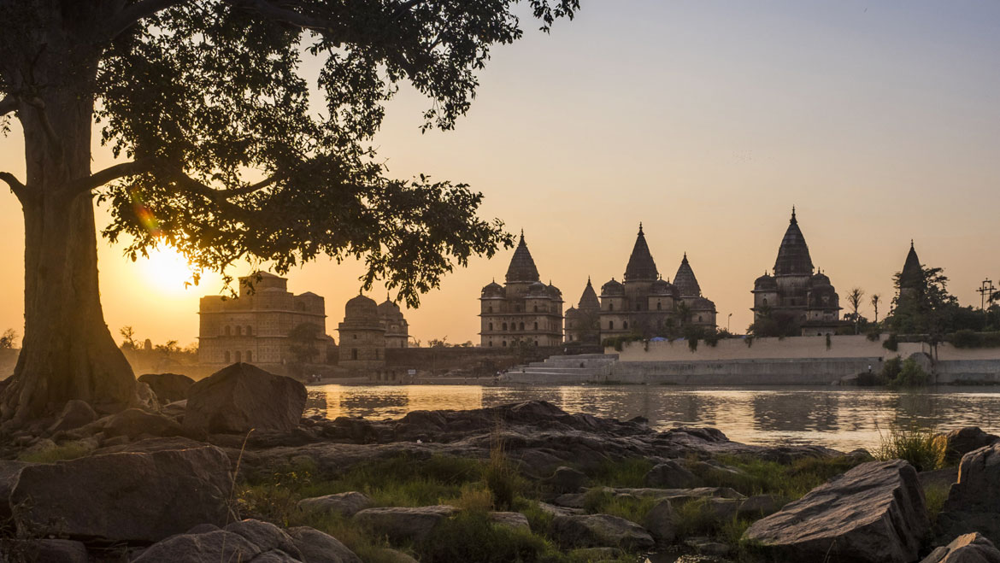

Alirajpur is a city in the Alirajpur tehsil in Alirajpur district in the state of Madhya Pradesh, India.

Alirajpur State was formerly a princely state of India, under the Bhopawar Agency in Central India. It lay in the Malwa region of Madhya Pradesh, near the border with Gujarat and Maharashtra. It had an area of 836 m².It had been from time to time under British administration. The Victoria bridge at Alirajpur was built to commemorate the Diamond Jubilee of 1897.

